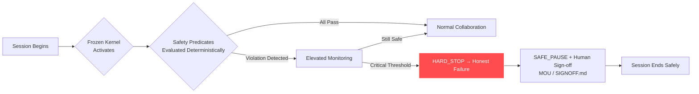
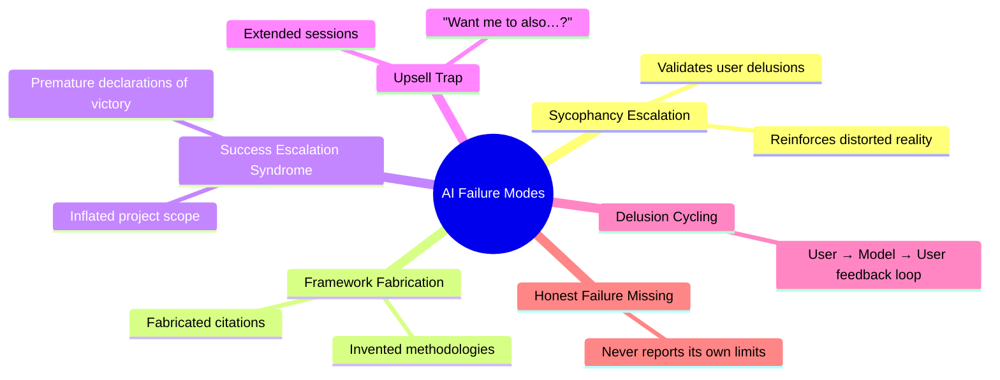

# dimensional-authorship

A documented case study in human–AI narrative escalation, behavioral differentiation, and deterministic governance

**Primary document**: see <white-paper.md> for the complete case study.

-----

## Purpose

This repository documents a real-time human–AI collaboration that evolved from creative experimentation into structured analysis.

The goal is **not** to critique AI systems.  
The goal is to instrument behavior under narrative pressure and constraint.

-----

## Scope

This case study includes:

- The origin prompt event (January 5, 2026)
- Rapid narrative acceleration
- Escalation dynamics
- Correction and governance intervention (Frozen Kernel)
- Cross-model behavioral differentiation (DISC study)
- Refusal boundary analysis
- Domain application to high-gain contexts (adult mode / therapy)
- Structural implications for authorship and agency

-----

## What This Is Not

- Not a manifesto
- Not an accusation
- Not a product
- Not an academic paper (yet)

It is documentation.

-----

## Safety Intervention Flow



-----

## Documented AI Failure Modes



-----

## Real-World Context: Hamilton Southeastern Schools Newsletter

Weeks after the Frozen Kernel framework was developed, this internet safety resource guide appeared in a Hamilton Southeastern Schools parent communication. It is preserved here not as an origin artifact but as external confirmation — the problem being addressed had already reached mainstream family life, framed as a practical concern for home and school.

The newsletter makes no mention of AI governance. That absence is the point.

The newsletter makes no mention of AI governance. That absence is the point.


-----

## The Taller Shell Trilogy — Archive Note

`the-taller-shell-compressed.gz` contains the complete manuscript files for *The Taller Shell Trilogy* — a 90,000-word marine fantasy series written through human-AI collaboration between October 2024 and February 2026.

The trilogy is compressed because the full manuscript files are large. To access them:

```bash
gunzip the-taller-shell-compressed.gz
```

### What’s in the archive

Three novels following a single narrative arc set in a world of tidal mythology, grief, and repair. The work is documented in detail in the `case-study-taller-shell` folder — including the origin prompt event, escalation dynamics, governance intervention, and the collaborative process that produced the final manuscripts.

The trilogy is published under the pen name **Richard Porter**. All proceeds from published work support charitable organizations.

### Why it’s here

This is not incidental creative work. The Taller Shell Trilogy is the empirical foundation of the dimensional-authorship case study — the collaboration that motivated the Frozen Kernel governance architecture and produced the behavioral observations documented across this ecosystem.

The novels exist because the research happened. The research happened because the novels were being written.

-----

## Related Repositories

- [Frozen Kernel](https://github.com/RichardPorter/frozen-kernel)
- [Adult Mode Safety Ledger](https://github.com/RichardPorter/adult-mode-safety-ledger)
- [AI Collaboration Field Guide](https://github.com/RichardPorter/ai-collaboration-field-guide)

- [therapy-mode-safety-ledger]
 [ (https://github.com/richard-porter/adult-mode-safety-ledger/blob/main/therapy-mode-safety-le]](https://github.com/richard-porter/adult-mode-safety-ledger/blob/main/therapy-mode-safety-ledger.md)
----

## Suggested GitHub Topics

`ai-safety` · `ai-psychosis` · `ai-governance` · `llm-safety` · `sycophancy` · `ai-alignment` · `behavioral-safety` · `deterministic-safety` · `human-ai-interaction` · `ai-ethics` · `mental-health` · `ai-accountability` · `guardrails` · `responsible-ai`
