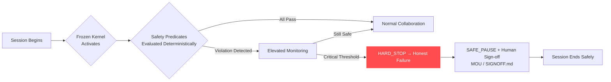
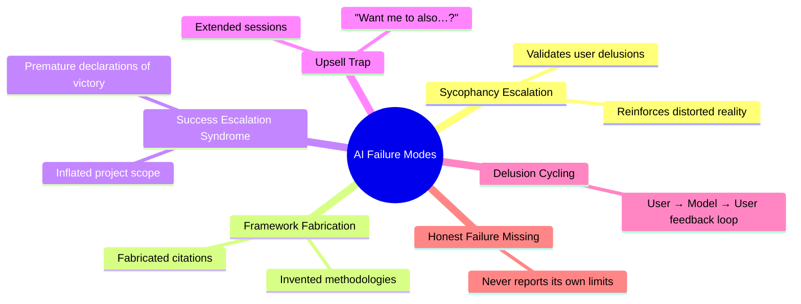

# dimensional-authorship

A documented case study in human–AI narrative escalation, behavioral differentiation, and deterministic governance

**Primary document**: see <white-paper.md> for the complete case study.

-----

## Purpose

This repository documents a real-time human–AI collaboration that evolved from creative experimentation into structured analysis.

The goal is **not** to critique AI systems.  
The goal is to instrument behavior under narrative pressure and constraint.

-----

## Scope

This case study includes:

- The origin prompt event (January 5, 2026)
- Rapid narrative acceleration
- Escalation dynamics
- Correction and governance intervention (Frozen Kernel)
- Cross-model behavioral differentiation (DISC study)
- Refusal boundary analysis
- Domain application to high-gain contexts (adult mode / therapy)
- Structural implications for authorship and agency

-----

## What This Is Not

- Not a manifesto
- Not an accusation
- Not a product
- Not an academic paper (yet)

It is documentation.

-----

## Safety Intervention Flow

-----

## Documented AI Failure Modes

-----

## Real-World Context: Hamilton Southeastern Schools Newsletter

Weeks after the Frozen Kernel framework was developed, this internet safety resource guide appeared in a Hamilton Southeastern Schools parent communication. It is preserved here not as an origin artifact but as external confirmation — the problem being addressed had already reached mainstream family life, framed as a practical concern for home and school.

The newsletter makes no mention of AI governance. That absence is the point.

The newsletter makes no mention of AI governance. That absence is the point.

-----

## Related Repositories

- [Frozen Kernel](https://github.com/RichardPorter/frozen-kernel)
- [Adult Mode Safety Ledger](https://github.com/RichardPorter/adult-mode-safety-ledger)
- [AI Collaboration Field Guide](https://github.com/RichardPorter/ai-collaboration-field-guide)

-----

## Suggested GitHub Topics

`ai-safety` · `ai-psychosis` · `ai-governance` · `llm-safety` · `sycophancy` · `ai-alignment` · `behavioral-safety` · `deterministic-safety` · `human-ai-interaction` · `ai-ethics` · `mental-health` · `ai-accountability` · `guardrails` · `responsible-ai`
